# remarkable-send

[](https://github.com/forcewake/remarkable-send/actions/workflows/ci.yml)
[](LICENSE)
[](#limitations-honestly)

**Markdown in — a beautifully typeset document on your reMarkable, one command later.**

Pages sized 1:1 to the e-ink panel · true 12 pt body · real page margins ·
newspaper-halftone images · clickable table of contents with measured page
numbers · sidebar bookmarks · zero pinching, zero zooming.

<p align="center">
  <a href="examples/showcase.pdf">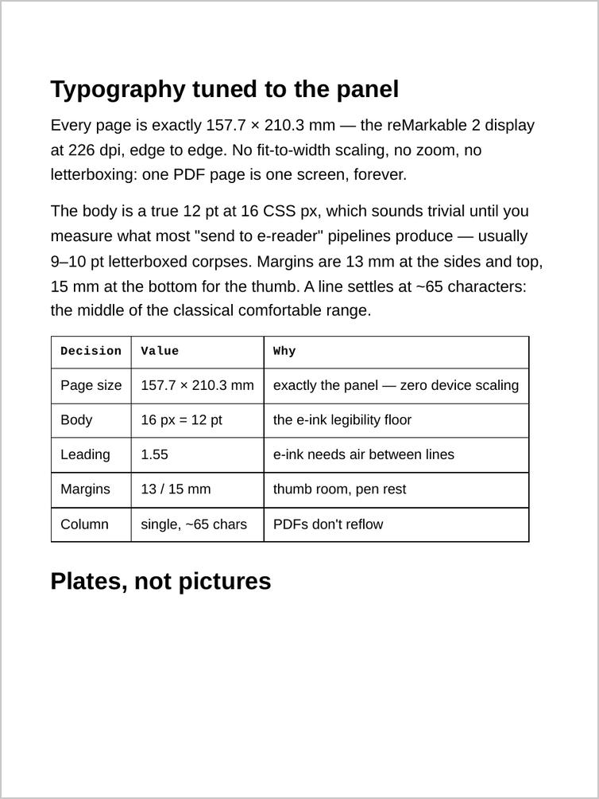</a>
  &nbsp;
  <a href="examples/showcase.pdf">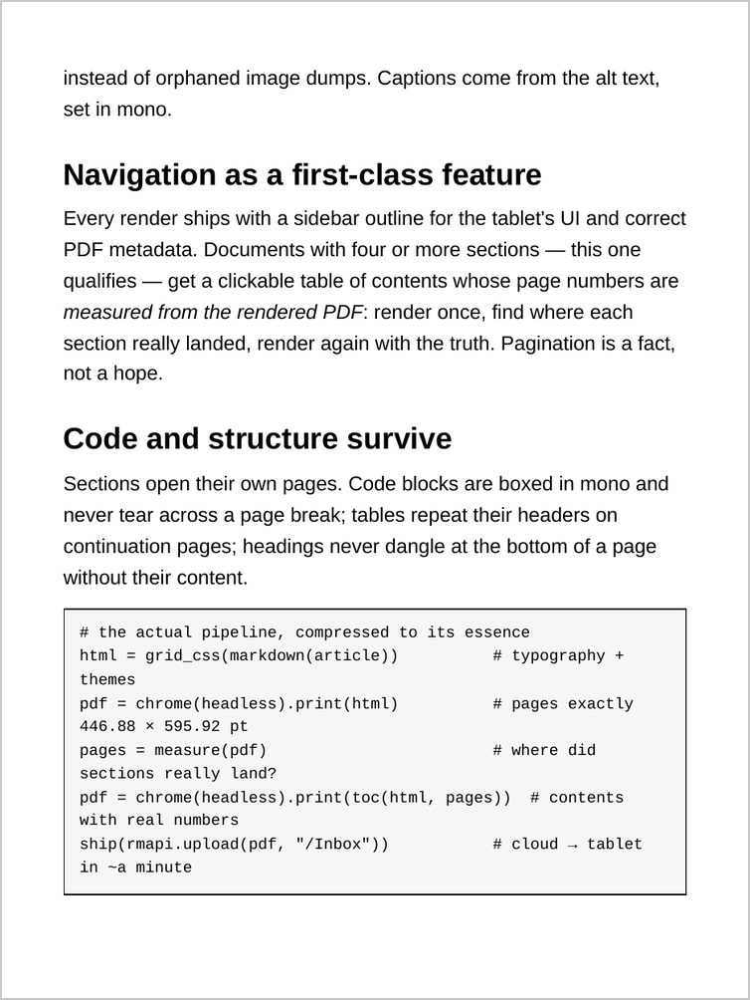</a>
  &nbsp;
  <a href="examples/signal-digest.pdf">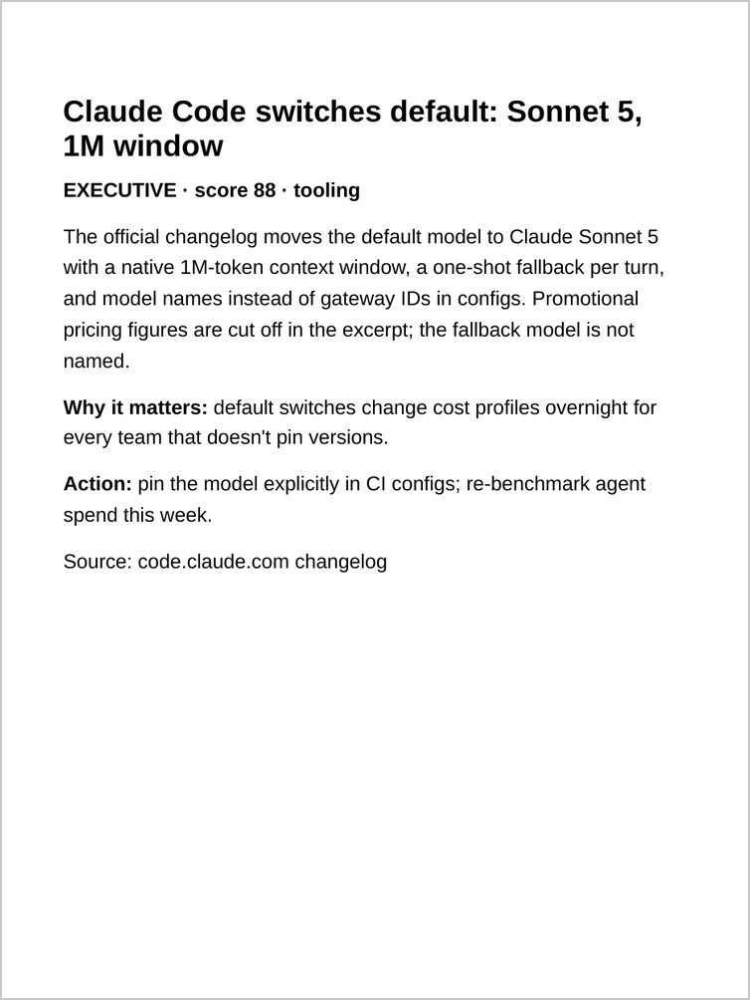</a>
  &nbsp;
  <a href="examples/brutal-layout.pdf">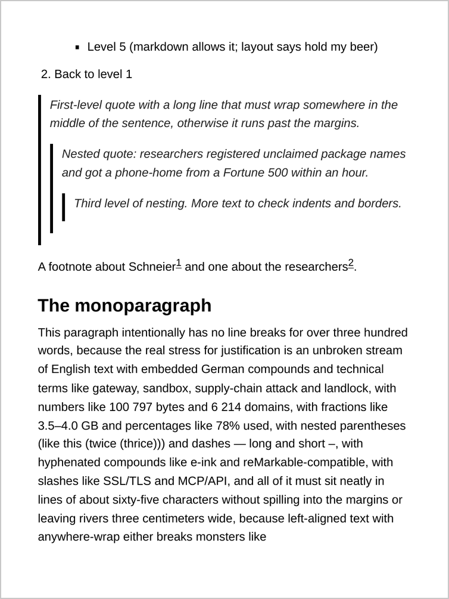</a>
</p>

Built as an agent skill ([Hermes Agent](https://github.com/NousResearch/hermes-agent)
/ Claude-style `SKILL.md`), it works just as well as a plain CLI — because
that's all it is underneath: three Python scripts and a headless Chrome.

---

## Why

The reMarkable is the best reading surface in the house and the worst place
to render for. Send a random PDF and you get letterboxed margins, 9 pt text
and photos that turn into noise across 16 gray levels. This pipeline was
tuned against the actual panel:

| Decision | Value | Why |
|---|---|---|
| Page size | 157.7 × 210.3 mm | exactly the rM2 screen (1404×1872 @ 226 dpi) — full-bleed, no device scaling |
| Margins | 13 mm / 15 mm | thumb room, pen rest; smaller than 12 pt body is a strain on e-ink |
| Body | 16 CSS px = 12 pt | the community-verified legibility floor for this panel |
| Column | single, ~65 chars | PDFs don't reflow; two columns force pinch-zoom |
| Color | pure black on white | 16 gray levels, no ghosting fills |
| Images | 1-bit Floyd–Steinberg @ 225 ppi | newspaper halftone; 1:1 device pixels, no resampling |

## What you get

- **Three themes** — `grid` (technical brief), `book` (serif, for essays),
  `compact` (dense, for manuals) — and two section rhythms:
  `--sections flow` (articles, default) or `--sections pages` (digests:
  one item per page).
- **Automatic navigation** — every document ships with a PDF outline for the
  tablet's sidebar, correct metadata, and — at ≥4 sections — a clickable
  table of contents whose page numbers are *measured from the actual PDF*,
  not guessed (two-pass render).
- **E-ink images** — fetch → grayscale → autocontrast → Floyd–Steinberg
  dither at device resolution. A 404 degrades into an italic caption, never
  a broken build.
- **Brutal-layout hardening** — wide tables repeat their headers on page
  breaks, headings never dangle or split, code blocks never tear, zalgo and
  base64 stay inside margins.
- **Reading queue tools** — list your Inbox as JSON, plan archiving of read
  items (dry-run by default), execute with one flag.

## Install

### Hermes Agent (one command)

```bash
hermes skills install forcewake/remarkable-send/skills/remarkable-send
```

### Claude Code / any SKILL.md-compatible agent

```bash
git clone https://github.com/forcewake/remarkable-send.git ~/.claude/skills/remarkable-send
```

(adjust the destination to wherever your agent loads skills from; the skill
references its scripts via `${HERMES_SKILL_DIR}` / its own directory)

### Just the CLI

```bash
git clone https://github.com/forcewake/remarkable-send.git
cd remarkable-send
pip install -r requirements.txt
./skills/remarkable-send/scripts/remarkable_send.py --file article.md --source example.com --dry-run
```

### Requirements

| Dependency | Notes |
|---|---|
| Python 3.10+ | `pip install -r requirements.txt` (markdown, pypdf, pillow) |
| Chrome/Chromium | headless print engine, on PATH |
| [`rmapi` (ddvk fork)](https://github.com/ddvk/rmapi) | cloud upload; found via `RMAPI_BIN`, `~/bin/rmapi` or PATH. ⚠️ the original `juruen/rmapi` is dead — reMarkable changed its auth |
| poppler (`pdftotext`, `pdftoppm`) | page measuring & previews |
| `pip install -r requirements.txt` | `markdown` (tables/footnotes), `pypdf` (PDF metadata), `pillow` (image preprocessing) |

Authenticate the tablet link once (one-time code from
[my.remarkable.com/device/browser/connect](https://my.remarkable.com/device/browser/connect),
then `echo CODE | rmapi ls /`). Cloud sync to the device requires a
reMarkable Connect subscription.

## Usage

Ask your agent:

> Send https://example.com/long-article to my reMarkable.

or drive it yourself:

```bash
# plain send
./scripts/remarkable_send.py --file essay.md --source newyorker.com

# a long read, serif
./scripts/remarkable_send.py --file chapter.md --theme book --folder "/Books"

# a digest: every section opens its own page
./scripts/remarkable_send.py --file digest.md --sections pages

# an article with photos: dither first, then send
./scripts/preprocess_images.py trip.md --workdir /tmp/img --out trip.eink.md
./scripts/remarkable_send.py --file trip.eink.md --source example.com

# what's on the tablet
./scripts/remarkable_manage.py list --folder "/Inbox"
```

Every render lands in `~/remarkable-out/YYYY-MM/` locally before upload.

## Examples

Sources and full PDFs in [`examples/`](examples/). Pages below are actual
renders — click a page to open the PDF.

### [Signal Digest](examples/signal-digest.pdf) — agent-curated intelligence

The form this pipeline ships daily in production: one news item per page,
section badges, scores, sources, watchlist discipline. Real events.
Source: [`signal-digest.md`](examples/signal-digest.md) · 9 pages · `--sections pages`

<p>
  <a href="examples/signal-digest.pdf">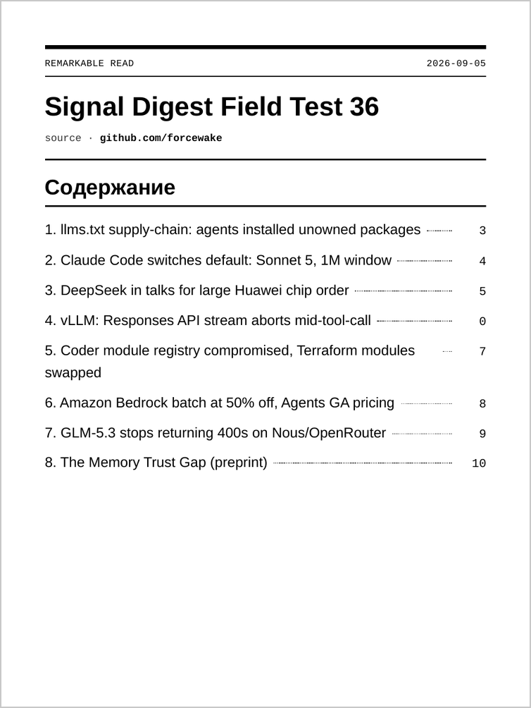</a>
  <a href="examples/signal-digest.pdf"></a>
  <a href="examples/signal-digest.pdf"></a>
  <a href="examples/signal-digest.pdf"></a>
</p>

### [The E-Ink Reading Pipeline](examples/showcase.pdf) — the full tour

Contents page with measured numbers, typography manifesto, decision table,
halftone plates, boxed code. Source: [`showcase.md`](examples/showcase.md) · 6 pages

<p>
  <a href="examples/showcase.pdf">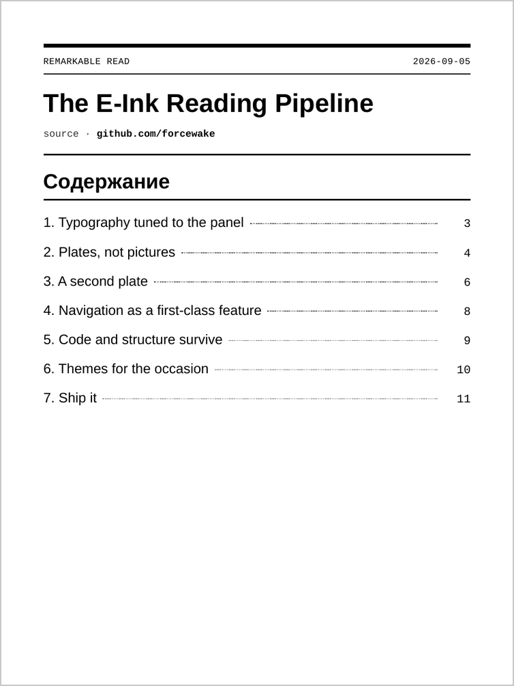</a>
  <a href="examples/showcase.pdf"></a>
  <a href="examples/showcase.pdf">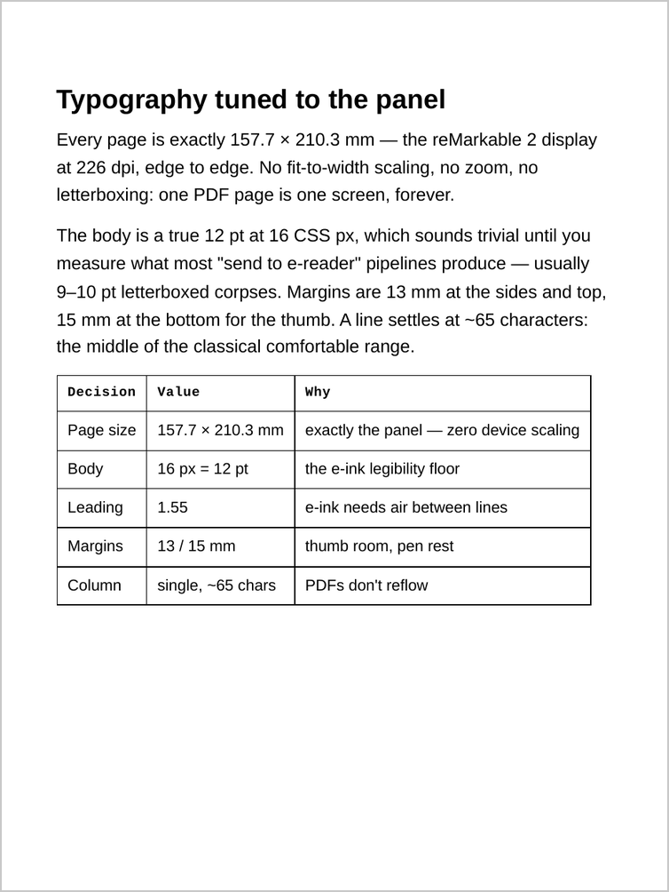</a>
  <a href="examples/showcase.pdf"></a>
  <a href="examples/showcase.pdf"></a>
</p>

### [Brutal Layout Stress Test](examples/brutal-layout.pdf)

Six-column tables, code taller than a page, a 30-row table with repeated
headers, unicode soup (CJK, RTL, zalgo), base64, a 300-word monoparagraph.
Source: [`brutal-layout.md`](examples/brutal-layout.md) · 11 pages

<p>
  <a href="examples/brutal-layout.pdf">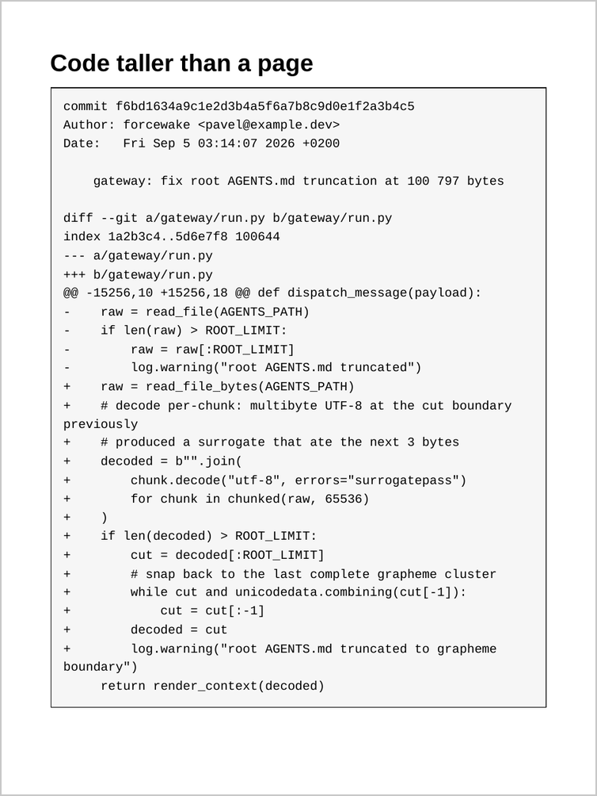</a>
  <a href="examples/brutal-layout.pdf">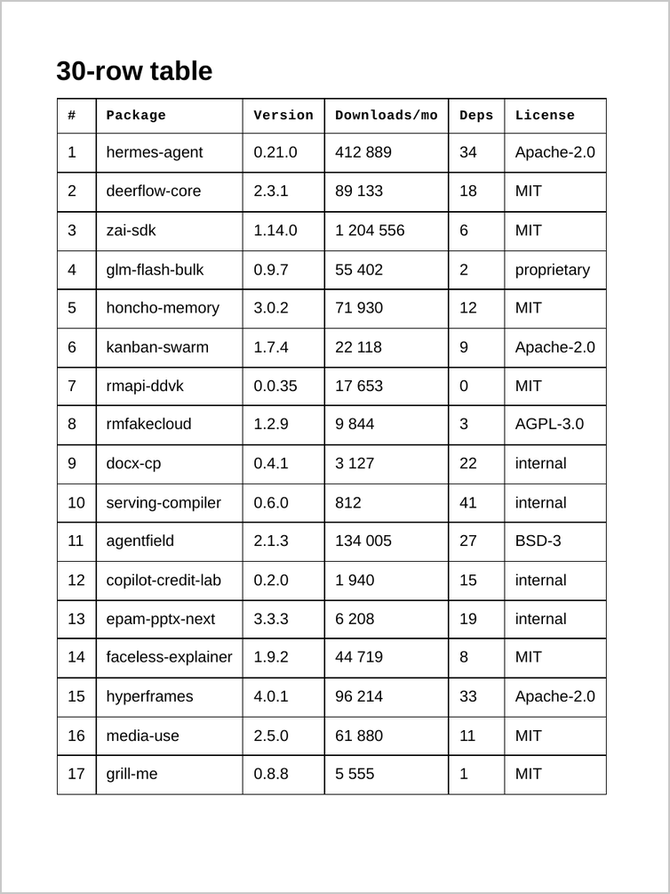</a>
  <a href="examples/brutal-layout.pdf"></a>
  <a href="examples/brutal-layout.pdf">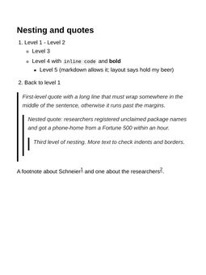</a>
</p>

### [Theme: Book](examples/theme-book.pdf) — the serif longform

Source: [`theme-book.md`](examples/theme-book.md) · `--theme book --sections pages` · 5 pages

<p>
  <a href="examples/theme-book.pdf">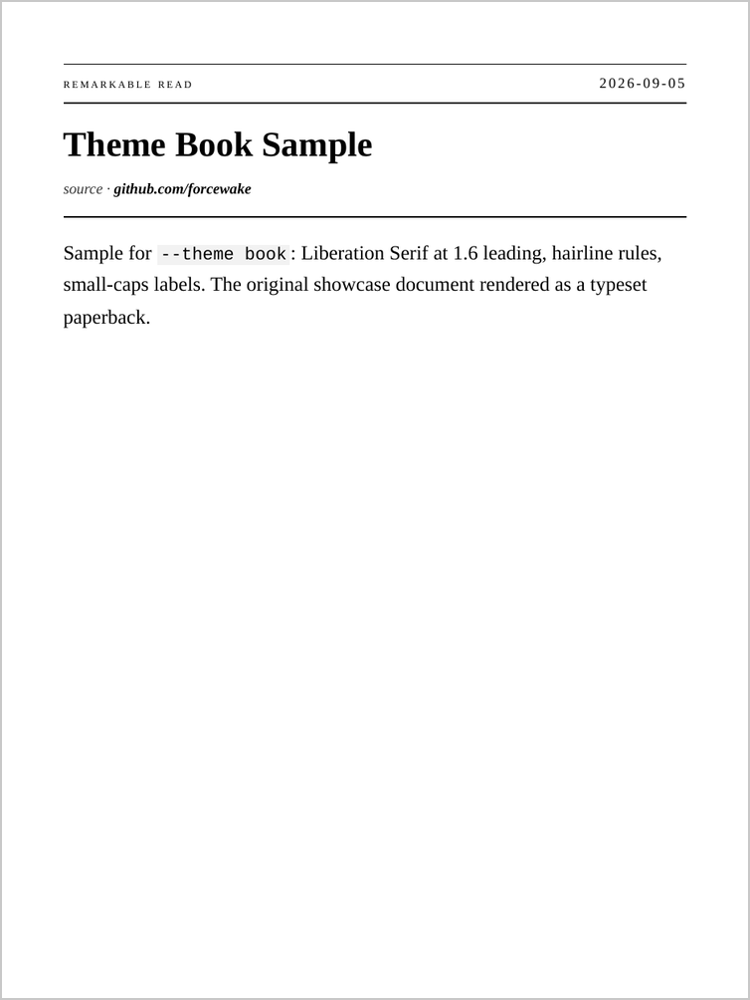</a>
  <a href="examples/theme-book.pdf">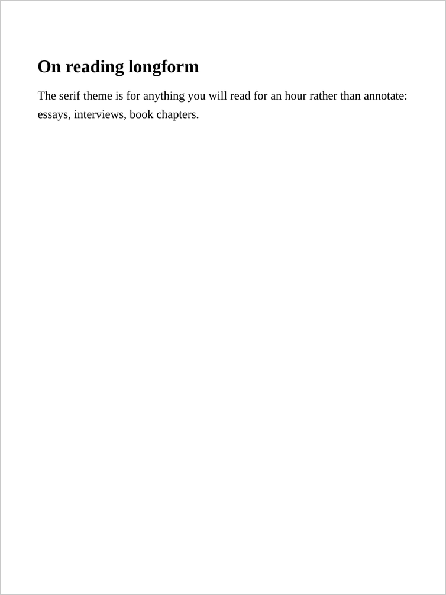</a>
  <a href="examples/theme-book.pdf">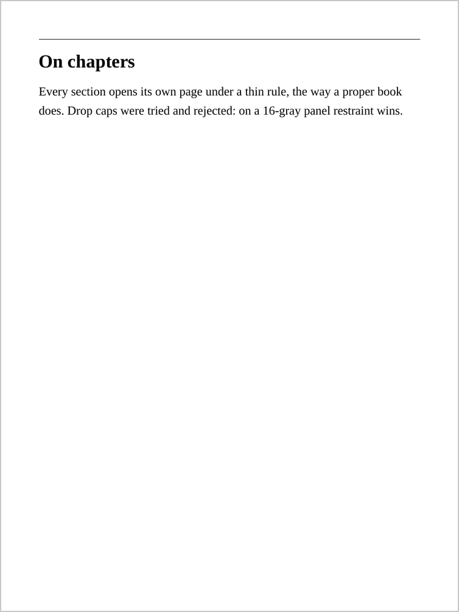</a>
  <a href="examples/theme-book.pdf">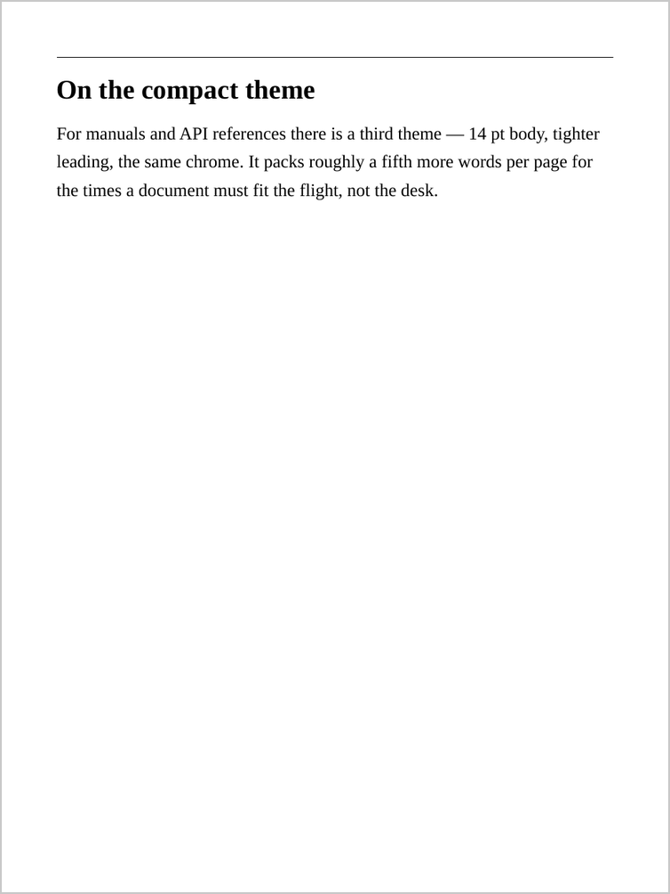</a>
</p>

---

## How it works

```
markdown ──▶ md_to_html ──▶ Grid CSS ──▶ chrome --headless --print-to-pdf
                │                             │
                │                     pdftotext measures reality:
                │                     where did each section land?
                ▼                             ▼
        preprocess_images.py          re-render with TOC numbers
        (grayscale + FS dither)              │
                                            ▼
                              pypdf: outline is chrome's,
                              metadata + ship via rmapi
```

The layout never trusts a screen-space measurement for print: the rendered
PDF itself is parsed to find where sections really landed, and anything that
spilled gets squeezed and re-rendered. Pagination is a fact, not a hope.

Full internals in [`references/`](skills/remarkable-send/references/): the
[design system](skills/remarkable-send/references/design-system.md) (every value and its reason),
[content preparation](skills/remarkable-send/references/content-preparation.md), and
[rmapi operations](skills/remarkable-send/references/rmapi-operations.md) (every trap we hit:
em-dash name matching, 429 bursts, tree-cache duplicates).

## Limitations, honestly

- reMarkable 2 geometry (works on any device that displays PDFs, but margins
  and font scale are tuned for the 10.3" 226 dpi panel; Paper Pro values are
  one CSS block away)
- No two-column reflow, no font selection on-device — that's PDF, that's the
  trade for pixel-exact pages
- Images are plates, not inline thumbnails

## License

[MIT](LICENSE) © Pavel Nasovich
